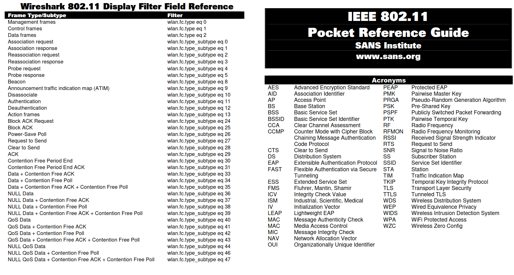
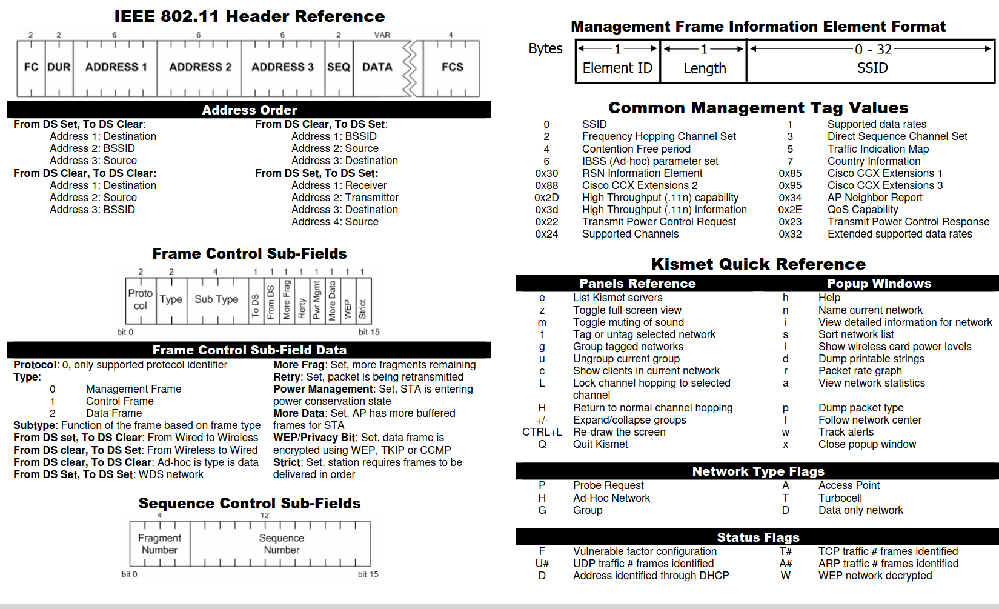

# 802.11 WLAN fuzz
- 802.11a
- 802.11b
- 802.11g
- 802.11n(Wi-Fi 4)
- 802.11ac(Wi-Fi 5)
- 802.11ad(WiGig)
- 802.11ax(Wi-Fi 6)
- 802.11ay 
- 802.11be(Wi-Fi 7)

在wifuzz的基础上做了些更改
>>>>>>><<<<<<<<<<<<<<<<<<<<<<<<<<<<<<<<<<<<<<<<<<<<<<<<
```text
# strat:
    sudo airmon-ng
    sudo airmon-ng check
    sudo airmon-ng check kill
    sudo airmon-ng start {NAME_OF_ATT_INTER}
    iwconfig
    sudo airodump-ng wlan0mon(essid:Ziroom_1802/ch:6 bssid:14:9F:4F:85:91:31)
    sudo iw wlan0mon set channel {AP_channel} HT20[频宽/40]
    sudo airmon-ng start wlan0mon 
# down:
    sudo airmon-ng stop wlan0mon 
    sudo NetworkManager
    
# start2:
    sudo ip link set wlx001d4310000e down
    sudo iw wlx001d4310000e set type monitor
    sudo ip link set wlx001d4310000e up
    sudo iw wlan0 set channel 36
# end
other :
    iwlist
    sudo iw dev wlan0mon set channel 
    wireshark: wlan.fc.type_subtype == 0x08
```
env: python3.10 scapy aircrack

os ubuntu22.04

fuzz.py的87行 和 widriver.py的 228需要自己改下ap mac(太懒了)

Beacon监听的逻辑还是有一些小问题

ref:
``
https://github.com/efchatz/WPAxFuzz

https://github.com/0x90/wifuzz

https://www.anquanke.com/post/id/84689

https://www.blackhat.com/docs/us-17/wednesday/us-17-Vanhoeft-WiFuzz-Detecting-And-Exploiting_Logical-Flaws-In-The-Wi-Fi-Cryptographic-Handshake.pdf

https://github.com/bullo95/WiFi--/tree/master/wifuzzit

https://github.com/nbdy/wifuzz

https://github.com/lucaboni92/BlueFuzz


